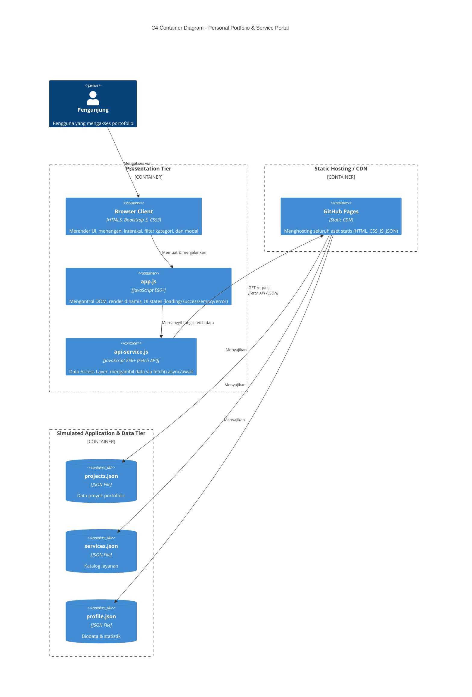

# Personal Portfolio & Service Portal — Week 4

**Nama:** Rahel Juri Elisabet Silaban
**NIM:** 12S24054
**Kelas:** S1 Sistem Informasi
**Live Demo:** https://rahelsilaban.github.io/ppw-2026-week2-12S24054/

---

## 1. Arsitektur Sistem (C4 Container Model)

Proyek ini telah ditransformasi dari arsitektur statis (hardcoded) menjadi arsitektur
decoupled multi-tier, memisahkan tanggung jawab tampilan, logika, dan data ke dalam
lapisan-lapisan terpisah.

### Separation of Concerns

Arsitektur ini memisahkan tiga kepentingan utama agar sistem lebih mudah dipelihara:

- **Presentation Tier** (`index.html`, `custom-style.css`, `app.js`) hanya bertanggung
  jawab menampilkan UI dan menangani interaksi pengguna, tanpa menyimpan data secara
  langsung di dalamnya.
- **Data Access Layer** (`api-service.js`) menjadi satu-satunya titik yang berkomunikasi
  dengan sumber data (fetch), sehingga jika sumber data berubah (misalnya nanti diganti
  REST API sungguhan), hanya file ini yang perlu disesuaikan — `app.js` tidak perlu diubah.
- **Data Tier** (`projects.json`, `services.json`, `profile.json`) berperan sebagai mock
  REST data provider yang independen, mensimulasikan bagaimana aplikasi nyata biasanya
  mengambil data dari backend API alih-alih menulisnya langsung di HTML.

Pemisahan ini membuat proyek lebih dekat dengan pola arsitektur web kontemporer
(decoupled, Jamstack-style) dibanding pendekatan monolitik Week 3 yang masih
menyatukan data dan tampilan dalam satu berkas HTML.

---

## 2. Tabel Komparasi: Sebelum vs Sesudah Refactoring

| Aspek | Week 3 (Sebelum) | Week 4 (Sesudah) |
|---|---|---|
| Sumber data card proyek | Hardcoded langsung di `index.html` | Dimuat dinamis dari `data/projects.json` via fetch() |
| Sumber data layanan | Hardcoded di HTML | Dimuat dinamis dari `data/services.json` |
| Modal detail proyek | Elemen modal terpisah untuk tiap proyek (duplikasi HTML) | Satu Universal Dynamic Modal, konten diinjeksi berdasarkan ID |
| Pengiriman form | Submit standar (kemungkinan reload halaman) | Asinkron via fetch POST, tanpa reload, dengan Bootstrap Toast |
| Penyimpanan riwayat pesanan | Tidak ada | Tersimpan di localStorage, ditampilkan di badge counter |
| Penanganan status loading/error | Tidak ada penanganan eksplisit | 4 UI states: Loading, Success, Empty, Error |
| Struktur folder | Flat (semua file di root) | Terstruktur: `/css`, `/data`, `/js` |
| Keamanan terhadap XSS | Tidak relevan (data statis) | Sanitasi via textContent/escapeHTML sebelum injeksi ke DOM |

---

## 3. Hasil Network Performance Profiling

Pengujian dilakukan menggunakan Chrome DevTools (tab Network), membandingkan kondisi
**Cold Load** (hard refresh, cache diabaikan) dengan **Warm Load** (refresh biasa,
memanfaatkan cache browser).

| Metrik | Cold Load | Warm Load |
|---|---|---|
| Jumlah request | 19 | 18 |
| Total data transferred | 451 kB | 104 B |
| Waktu load halaman (Load event) | 2.29 s | 373 ms |
| Status dokumen utama (index.html) | 200 | **304 Not Modified** |
| TTFB — projects.json | 8.94 ms | 1.17 ms |
| Content download — projects.json | 8.97 ms | 1.16 ms |
| Total duration — projects.json | 25.25 ms | 5.02 ms |
| Sumber file JSON (projects/services/profile) | Network (200) | Disk cache |
| Sumber file statis (CSS, JS, font) | Network (200) | Memory cache (0 ms) |

### Analisis

- **TTFB turun drastis** dari 8.94 ms menjadi 1.17 ms pada Warm Load, karena pada
  Cold Load browser harus membuat koneksi baru dan menunggu respons penuh dari server,
  sedangkan pada Warm Load sebagian besar permintaan divalidasi atau diambil langsung
  dari cache lokal.
- **Status 304 Not Modified** muncul pada dokumen utama saat Warm Load, membuktikan
  mekanisme caching sesuai RFC 9111 bekerja: browser memvalidasi ke server apakah
  berkas berubah, dan karena tidak ada perubahan, server merespons tanpa mengirim
  ulang body — menghemat bandwidth.
- **File statis** (CSS, JS, font) bahkan tidak lagi melakukan request ke server sama
  sekali pada Warm Load — langsung diambil dari **memory cache** dengan waktu 0 ms,
  lebih cepat dibanding file JSON yang diambil dari **disk cache** (±27 ms per file).
  Ini menunjukkan browser memprioritaskan memory cache untuk aset yang sering diakses
  dalam sesi yang sama.
- **Total data yang ditransfer** turun dari 451 kB menjadi hanya 104 B — penghematan
  bandwidth hampir 100% pada kunjungan berulang.

### Screenshot Waterfall

**Cold Load:**
<!-- Tempel screenshot cold-load.png di sini -->

**Warm Load:**
<!-- Tempel screenshot warm-load.png di sini -->

---

## 4. Live Deployment

🔗 **Live Demo:** https://rahelsilaban.github.io/ppw-2026-week2-12S24054/
📁 **Branch:** `week4-architecture`